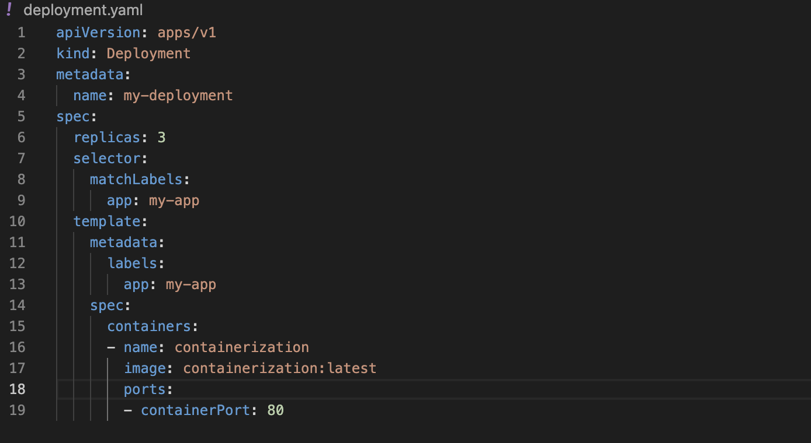

# Capstone Project - Containerization and Container Orchestration

## Phase 1: Basic Frontend Application with Docker and Kubernetes

#### i. Hypothetical use case

Developing a simple static website (HTML and CSS) for a company's landing page. The goal is to containerize this application using Docker, deploy it to a Kubernetes cluster, and access it through Nginx.

#### ii. Project setup

- A project directory is created (Containerization).

- Inside the directory an HTML and CSS file are created (index.html and styles.css)

#### iii. Git initialization

A git repository is initialize for my project directory, this keeps record of any changes in my project.

`git init`

#### iv. Git Commit

A git add and commit are done. This allow git to be aware of files in my folder so as to keep track of any changes been made on them and by commiting simply give description of any changes made.  

`git add .`

`git commit -m "first commit"`

#### v. Dockerizing the Application

- In my project directory (Containerization), an html and css file was created with a basic code for simple web application.

See image below: 

- In the same directory a Dockerfile was created to setup Nginx server

See image below: 

- The Dockerfile uses the official Nginx image and copies my HTML and CSS files into the default directory that Nginx serves from, which is /usr/share/nginx/html.

 - The next step is to build the image and run the Docker Container

 `docker build -t containerization .`

- After running the above command, docker will build my image base on the instructions in the Dockerfile inside the project foldeer named (containerization).

See image below: 

- My docker image has been built, now it's time to run the container based on it.

`docker run -d -p 8080:80 --name nginx-container containerization`

The command above runs the container in a detached mode (-d), maps port 80 in the container to port 8080 on my host machine (-p 8080:80), and names the container nginx-container.

#### vi. Pushing my built docker image to Dockerhub

`docker login`

The above command will prompt me to enter my Docker Hub username and password.

- Docker images are identified by repository:tag. To push an image to Docker Hub, I need to tag it with my Docker Hub username and the repository name.
 
 `docker tag containerization bolajidevops/containerization:latest`

- After tagging my image, the next step is to push to dockerhub but before doing that i need to create a repository on dockerhub with the corresponding name
  (containerization) and the repo visibility is set to public. 

  `docker push bolajidevops/containerization:latest`

- My image has been successfully pushed to dockerhub, See images below:

 
 

#### vii. Setting up a kind Kubernetes Cluster

`brew install kind`

The above command install kind (kubernetes in Docker) on my system. See image below:

- After installing kind, we need to create a kind using the command `kind create cluster` This command creates a cluster named (kind) by default. See image below:

#### viii. Deploying to Kubernetes

Creating a Kubernetes Deployment YAML file specifying the image and desired replicas.

`touch deployment.yaml`

To create a Kubernetes Deployment YAML file that specifies a container image and the desired number of replicas, the above template is used.

`kubectl apply -f deployment.yaml`

The above command will create the Deployment as defined in my YAML file.

The above image shows the running state of my deployment

#### ix. Creating a service (ClusterIP)

The above images shows the manifest for my ClusterIP service and after it's been apply to my cluster.

#### x.  Accessing the Application

To access the application locally i will need to port-forward to the service created using the command below

`kubectl port-forward service/deployment-service :80`

The above image shows the port-forward to the service (deployment-service), now to access my frontend application i will simply copy the address (127.0.0.1:64840 ) to my browser. 

See the image below:

